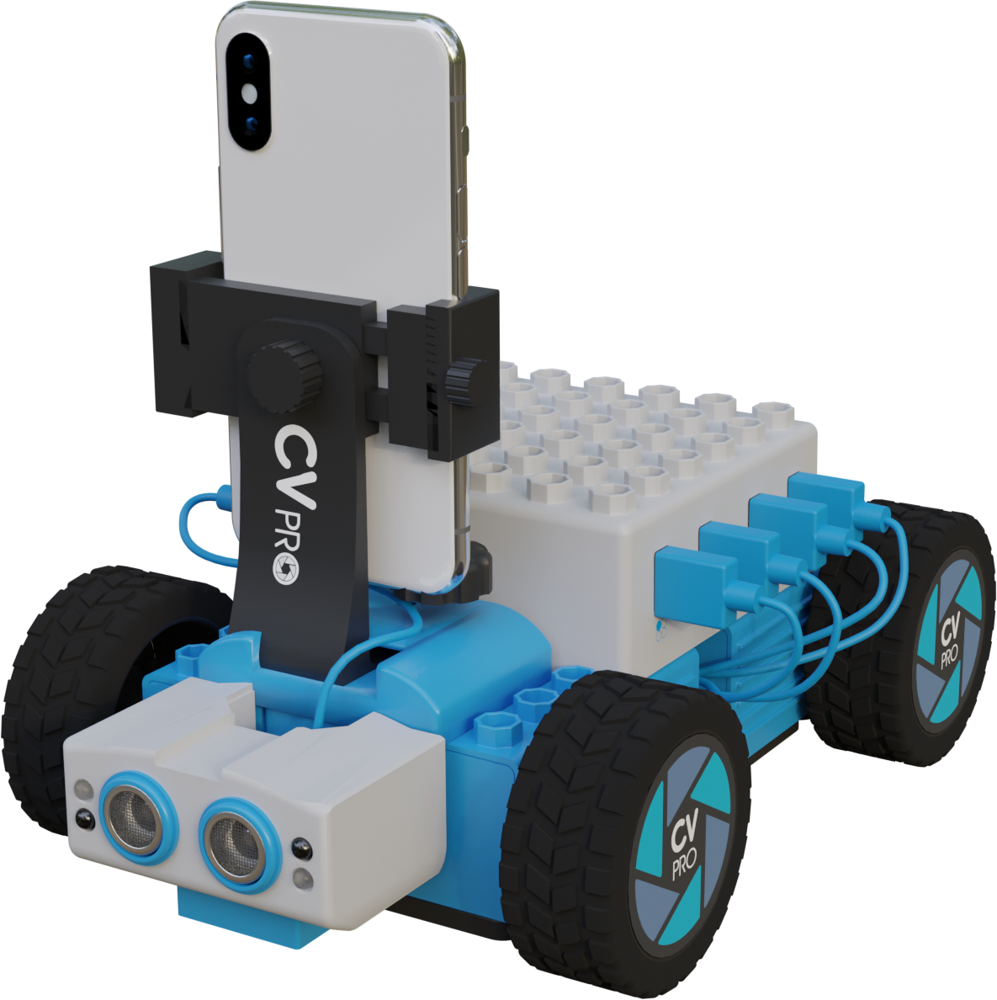
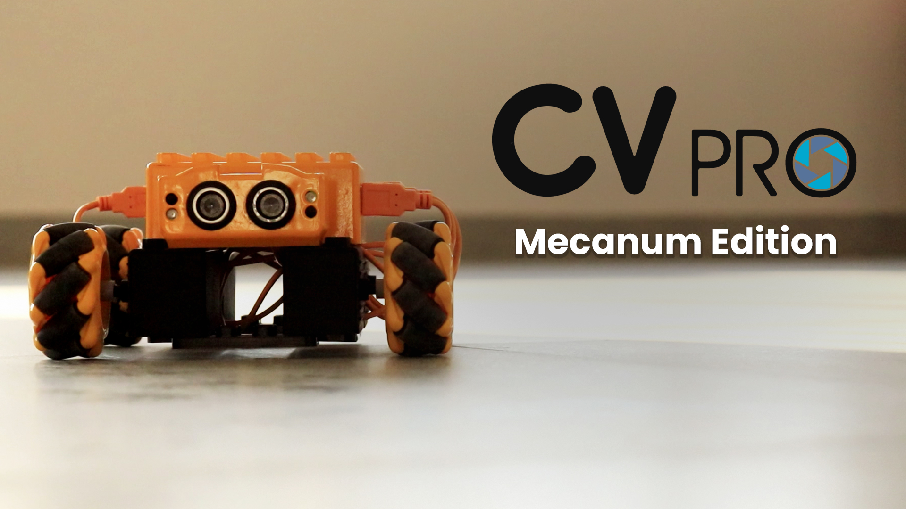

# CV Pro
<p align="center" width="80%">
    
</p>

CV Pro is a cutting-edge development and education platform with smart computer vision technology. This utilizes the extensive sensor suites, powerful computational abilites and state-of-the-art communication channels. They enable users to learn the intricacies of AI techonlogies such as Machine Learning, Deep Learning, which are utilized in real-time Autonomous Vehicles.

## Get the source code

- You can download the repository as a [zip file](https://github.com/robotixdevteam/Meritus-CVPRO/archive/refs/heads/master.zip) and extract it into a folder of your choice.
- You can clone the Meritus-CVPRO repository from GitHub with the following command:

    ```bash
    git clone https://github.com/robotixdevteam/Meritus-CVPRO.git
    ```

## Install the apps

The easiest way to get either of the apps is to download it directly to the phone using the corresponding QR code. 

<table style="width:80%;border:none; text-align=center;">
  <tr>
    <td>
        <p aligin='center'>
        
        </p>
    </td>
    <td>  
        <p aligin='center'>
        
        </p>
    </td>
  </tr>
  <tr>
    <td><strong>Android 📱 App</strong></td>
    <td><strong>iOS 📱 App </strong></td>
  </tr>
</table>


## You first need to setup your environment.

## Dependencies

We recommend to create a conda environment for CVPRO. Instructions on installing conda can be found [here](https://docs.conda.io/projects/conda/en/latest/user-guide/install/). The easiest way to create a new environment with all dependencies is to use one of the provided environment files. On Windows, you will also need to install [Microsoft C++ Build Tools](https://visualstudio.microsoft.com/visual-cpp-build-tools/). Make sure you are in the folder `Environment_Setup` within your local Meritus-CVPRO repository. Based on your operating system, run the corresponding command:

### Environment Setup

First create a new conda environment with the following command:

```bash
conda create -n cvpro python=3.9 -y
```

Next, you need to activate your conda environment:

```bash
conda activate cvpro
```

Once your environment is active, install __TensorFlow__. For optimal training speed, especially on dedicated workstations or computers with dedicated GPUs, we recommend installing the necessary libraries and keeping your GPU drivers up to date. See below for TensorFlow installation commands on different Operating Systems.

#### **Windows**
```
pip install tensorflow~=2.9.0
```

GPU support
```
conda install cudatoolkit=11.3 cudnn=8.2 -y
```

#### **Linux**
```
pip install tensorflow~=2.9.0
```

GPU support
```
sudo apt-get install nvidia-driver-510
conda install -c conda-forge cudatoolkit=11.2 cudnn=8.1 -y
echo 'export LD_LIBRARY_PATH=$LD_LIBRARY_PATH:$CONDA_PREFIX/lib/' >> ~/.bashrc
source ~/.bashrc
```
[Troubleshooting](https://www.tensorflow.org/install/pip#linux)

#### **Mac**
```
conda install -c apple tensorflow-deps -y
pip install tensorflow-macos~=2.9.0
```

GPU support
```
pip install tensorflow-metal~=0.5.0
```
[Troubleshooting](https://developer.apple.com/metal/tensorflow-plugin/)

#### **Additional Requirements**

Make sure you are in the folder, `Environment_Setup` within your local Meritus-CVPRO repository. Now, you can install all the remaining dependencies using the following command:

```bash
pip install -r requirements.txt
```
### Notes

- Remember to activate the environment, before running commands in the terminal: `conda activate cvpro`
- If your tensorflow import does not work, try installing via `pip install tensorflow --user`. 

## MQTT 

### Installation of Packages

Install the Mqtt in your local system. Here, are the step-by-step instructions for downloading mosquitto MQTT Broker:

1. Click [here](https://mosquitto.org/files/binary/win64/mosquitto-2.0.15-install-windows-x64.exe) for Windows 64-bit OS and [here](https://mosquitto.org/files/binary/win32/mosquitto-2.0.15-install-windows-x86.exe) for Windows 32-bit OS. (Note: Download the version that corresponds to your Windows build).

2. For macOS, open your terminal and enter the following command to install mosquitto using the homebrew project.

    ```bash
    brew install mosquitto
    ```

3. For Ubuntu-OS, open your terminal and run the following commands:

    ```bash
    sudo apt-add-repository ppa:mosquitto-dev/mosquitto-ppa
    sudo apt-get update
    ```
    These commands will add the mosquitto repository to your sources list and update your package lists. You can then install mosquitto using the following command:

    ```bash
    sudo apt-get install mosquitto
    ```

***Important Note:*** If you own CV Pro with Mecanum wheels, you are in for an exciting experience. Skip the following sections and simply [click](#Mecanum) to learn how to operate your kit with these innovative wheels. **`The CV Pro Mecanum version can be operated without the need for a smartphone`**.

# Connection

## How to Set up the Local Server Connection:

1. First, disable the Mobile-data and disconnect existing WiFi connections of your phone. Enable the WiFi feature on your computer and ensure that computer is within proximity for better connection.

2. Turn on the CV Pro bot, that acts as the hotspot and check if unique ID of your bot is displayed in the WiFi connection. Establish connection by entering the `WiFi-Name = 'cvpro<unique-ID>' (for example, 'cvpro0123')` and `Wifi-Password = '12345678'`.

3. Initiating server:

- For `Windows`, navigate to the folder where the mosquitto package is installed (`C:\ProgramFiles\Mosquitto`). Copy the configuration file, `mqtt_conf.conf` from the `Environment_Setup` folder in local Meritus-CVPRO repository and paste into the Mosquitto installation folder. Open the Command-Prompt/Terminal from this folder. 

    - Type or paste following command and your server will start. 

        ```bash
        mosquitto -v -c .\mqtt_conf.conf
        ```

- For `Linux/Ubuntu`, you need not navigate to the installed path or copy the configuration file. Just launch the Terminal,

    - command >> cd '_path to the_ **mqtt_conf.conf** _file which is present in downloaded local `Meritus-CVPRO` repository in folder `Environment_Setup`_'.

    - Type or paste following command and your server will start. 

        ```bash
        mosquitto -v -c mqtt_conf.conf
        ```

- For `Mac`, you need not navigate to the installed path or copy the configuration file. Just launch the Terminal,

    - command >> cd '_path to the_ **mqtt_conf.conf** _file which is present in downloaded local `Meritus-CVPRO` repository in folder `Environment_Setup`_'.

    - Type or paste following command and your server will start.  

        ```bash
        mosquitto -v -c mqtt_conf.conf
        ```

4. Now connect smartphone to the same WiFi name as you connected your computer.

5. Launch the CV Pro Application and tap on `Settings`:gear: icon, which is on top-right corner of the screen. In the 'Settings' Screen, option displayed, tap on '`Server connection` menu. A new screen will be opened with options to enter `IP Address` and `Name to connect` fields. Enter the IP address, `192.168.4.2` and  `cvpro` in Name to connect field. Then click on `Connect` button to connect to the server.

***Note: If you are unable to establish connection, repeat the steps 1-to-4.***

6. To activate your environment,
- For **Windows**, Open the Anaconda Prompt,

    ```bash
    conda activate cvpro
    ```

- For **Linux/Ubuntu**, Open the Terminal,

    ```bash
    conda activate cvpro
    ```

- For **Mac**, Open the Terminal, 

    ```bash
    conda activate cvpro
    ```

**Note:** If you receive message `EnvironmentNameNotFound`, after this step, create and activate the environment, by following steps in [Dependencies](#Dependencies).

# How to use the CV PRO APPLICATION with CV PRO BOT

## Collect Data 

In order to train the bot, you need to collect a dataset. The more quality data you collect, you get better output.

1. Press the `Collect Data` button which is in the Home Screen. _Allow the necessary permissions to take pictures and record videos_.

2. In the Data Collection Screen, verify the _connection status_ (placed at top-left side). If _not connected_, re-connect by following the steps in [server connection](#Connection) section.

3. When the connection is established with Local Server, check if the Anaconda environment is activated or not in your computer. Verify this, by navigating to your Anaconda Prompt. If environment is inactive, reactivate environment by repeating the sixth (`6th`) step of [server connection](#Connection) section.

4. Check the Anaconda Prompt, whether you are in the path of `Controller` in Local `Meritus-CVPRO` Repository. If not, change the path in Anaconda Prompt using this command,

- command >> cd '_path to the python file which is present in downloaded local `Meritus-CVPRO` repository in folder `Controller`_'.

- Type or paste the following command in Anaconda Prompt, for _only Data Collection and bot control_ use this command. 

    ```bash
    python control_bot.py
    ``` 

- Type or paste the following command in Anaconda Prompt, for _Data Collection with video-stream and bot control_ use this command.

    ```bash
    python videostream_control_bot.py
    ``` 

5. Place the bot on the track and now you can control the bot as well as collect the data based on the controls keys which will be displayed after running the above python command.

6. After completing the data collection process, close the 'CV PRO Application' on your smartphone. Disconnect the connection between the devices by closing the server connection on the computer, using '_ctrl+c_' or '_command+c_,' or clicking the 'X' in the Command Prompt or Terminal from where you are running the server connection. 

7. Copy the collected data from the folder `CVPRO` in your smartphone to your computer. Open the local `Meritus-CVPRO` repository and go to the location -> `Training_Process\Training_Data\Dataset_CVPRO\` and place it in `Autonomous_Driving` folder to enable the movement of bot in _autonomous mode_. For the image classification, place the data collected in, `Image_Classification` folder to _classify the images_.

**Note: Avoid pasting the compressed files directly. Make sure to extract the files first.**

## Training Process

Make sure your conda environment for CVPRO is activated by executing the following command:

```bash
conda activate cvpro
```

The training process can be visualised either in Python script or in jupyter notebook:

- To start in the Python script, navigate to the folder, `Training_Process` within your local `Meritus-CVPRO` repository. Type or paste the following command in Anaconda Prompt,

```bash
python main.py
``` 

- To visualize the same using Jupyter notebook, you can use jupyter notebook file "**main.ipynb**". Type or paste the following command in Anaconda Prompt,

```bash
jupyter notebook main.ipynb
```

After training process is complete, the script will generate three files (_best.tflite, last.tflite and label.txt_). The files are saved in the location `Training_Process -> Training_Data -> Save_Model`.

Copy/Move the above three files from computer to smartphone to the folder of your choice.

## Model Management

To upload the model, Open the _CV PRO_ Application in your smartphone and go to `Settings`:gear: icon. Tap on the `Model management` section and click the `upload file` button, select the "***best.tflite*** or ***last.tflite***" from the saved location. 

After the file is uploaded, a menu will appear at the bottom of the screen. From there, you can _change the model's name_ and choose the category in which you want to place the model, from the list of categories displayed. To upload the `label.txt` text file, simply tap on the :paperclip: icon and tap on `Submit` button.

Go to home Screen in _CV PRO_ Application, choose an option among the menu,
- Click the **Autonomous Driving** to run on autonomous mode.
- Click the **Image Classification** to classify the image.
- Click the **Object Detection** to follow an object from the list of objects.


# Mecanum
<p align="center" width="100%">
    
</p>

# CV Pro with Mecanum Wheels

CV Pro is now equipped with the new feature: **`Mecanum wheels`**. Swap the existing wheels with the Mecanum wheels provided. These omnidirectional wheels can move in any direction, offering incredible maneuverability.

## Connection

## How to Setup the Local Server Connection
1. Ensure that computer is within proximity and turn-on the CV Pro bot, that acts as the hotspot and check if unique ID of your bot is displayed in the WiFi connection. Establish connection by entering the `WiFi-Name = 'cvpro<unique-ID>' (for example, 'cvpro0123')` and `Wifi-Password = '12345678'`.

2. Initiating server:

- For `Windows`, navigate to the folder where the mosquitto package is installed (`C:\ProgramFiles\Mosquitto`). Copy the configuration file, `mqtt_conf.conf` from the `Environment_Setup` folder in local Meritus-CVPRO repository and paste into the Mosquitto installation folder. Open the Command-Prompt/Terminal from this folder. 

    - Type or paste following command and your server will start. 

        ```bash
        mosquitto -v -c .\mqtt_conf.conf
        ```

- For `Linux/Ubuntu`, you need not navigate to the installed path or copy the configuration file. Just launch the Terminal,

    - command >> cd '_path to the_ **mqtt_conf.conf** _file which is present in downloaded local `Meritus-CVPRO` repository in folder `Environment_Setup`_'.

    - Type or paste following command and your server will start. 

        ```bash
        mosquitto -v -c mqtt_conf.conf
        ```

- For `Mac`, you need not navigate to the installed path or copy the configuration file. Just launch the Terminal,

    - command >> cd '_path to the_ **mqtt_conf.conf** _file which is present in downloaded local `Meritus-CVPRO` repository in folder `Environment_Setup`_'.

    - Type or paste following command and your server will start.  

        ```bash
        mosquitto -v -c mqtt_conf.conf
        ```

3. Navigate to the `...\Meritus-CVPRO-main\Controller` directory, from your Anaconda prompt.

4.	To activate your environment,
- For **Windows**, Open the Anaconda Prompt,

    ```bash
    conda activate cvpro
    ```

- For **Linux/Ubuntu**, Open the Terminal,

    ```bash
    conda activate cvpro
    ```

- For **Mac**, Open the Terminal, 

    ```bash
    conda activate cvpro
    ```
**Note:** If you receive message `EnvironmentNameNotFound`, after this step, create and activate the environment, by following steps in [Dependencies](#Dependencies).

5.	In Anaconda prompt, run the following command to set your kit in motion:

    ```bash
    python mecanum_control_bot.py
    ```

6.	A pygame controller window will appear on your computer screen, allowing you to control your robot using the key combinations provided. Observe your kit's smooth, multidirectional movement.

With CV Pro's new Mecanum wheels, you have expanded possibilities for hands-on learning.


## Contact

- Contact us via [Email](mailto:development@merituseducation.com)


