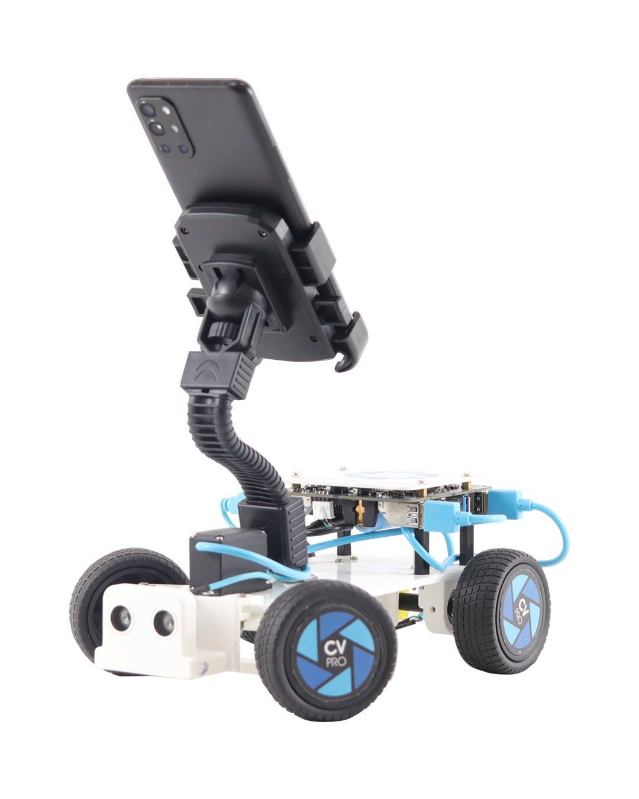

# CV Pro
<p align="center" width="80%">
    
</p>

CV Pro is a cutting-edge development and education platform with smart computer vision technology. This utilizes the extensive sensor suites, powerful computational abilites and state-of-the-art communication channels. They enable users to learn the intricacies of AI techonlogies such as Machine Learning, Deep Learning, which are utilized in real-time Autonomous Vehicles.

## Get the source code

- You can download the repository as a [zip file](https://github.com/robotixdevteam/Meritus-CVPRO/archive/refs/heads/master.zip) and extract it into a folder of your choice.
- You can clone the Meritus-CVPRO repository from GitHub with the following command:

    ```bash
    git clone https://github.com/robotixdevteam/Meritus-CVPRO.git
    ```

## Install the apps

The easiest way to get either of the apps is to download it directly to the phone using the corresponding QR code. 

<table style="width:80%;border:none; text-align=center;">
  <tr>
    <td>
        <p aligin='center'>
        
        </p>
    </td>
    <td>  
        <p aligin='center'>
        
        </p>
    </td>
  </tr>
  <tr>
    <td><strong>Android 📱 App</strong></td>
    <td><strong>iOS 📱 App </strong></td>
  </tr>
</table>


## 🌟 What Can You Do With CVPRO?

CVPRO bridges computer vision and robotics through:

- **Real-Time Object Recognition** - Process live camera feeds to detect objects, signs, or gestures  
- **Smart Robot Control** - Convert visual inputs into precise MQTT commands for robot movement  
- **Train Custom Models** - Collect vision datasets and train AI models tailored to your robotics application  
- **Cross-Platform Ready** - Works seamlessly on Windows, macOS, and Linux systems  

## 🚀 How It Works (3-Step Flow)

### 1. Setup & Installation
- One-time installation of Python environment and MQTT broker  
- Automatic dependency management via Conda  

### 2. Launch Vision Services
- Start the MQTT communication server  
- Initialize camera streaming with optional:  
  - *Live control mode* (direct robot movement)  
  - *Data collection mode* (for model training)  

### 3. Execute Your Workflow
**For Robot Control:**
- System processes visual inputs in real-time  
- Automatically sends movement commands when detecting target objects  

**For Model Training:**
- Collect labeled image datasets through guided process  
- Train custom vision models with optimized parameters  
- Deploy new models with one command  

## 🔧 Troubleshooting & Connections
For detailed troubleshooting, connection diagrams, and advanced configuration, refer to our [Complete Technical Documentation](https://example.com/cvpro-docs).

## 💡 Key Advantages
✔ **No Coding Required** - Guided terminal interface handles complex workflows  
✔ **Hardware Agnostic** - Works with most cameras and MQTT-compatible robots  
✔ **Learning Optimized** - Preset configurations for education and research  

## 📥 Getting Started
1. Download the package for your OS  
2. Run the initialization script  
3. Follow the interactive terminal guide  

> *"From classroom to research lab - CVPRO scales with your vision needs"*

## 📚 Platform Guides
- [Windows Instructions](https://github.com/robotixdevteam/Meritus-CVPRO/tree/Windows)  
- [macOS Setup](https://github.com/robotixdevteam/Meritus-CVPRO/tree/Mac)  
- [Linux Configuration](https://github.com/robotixdevteam/Meritus-CVPRO/tree/Linux)  

---
 

